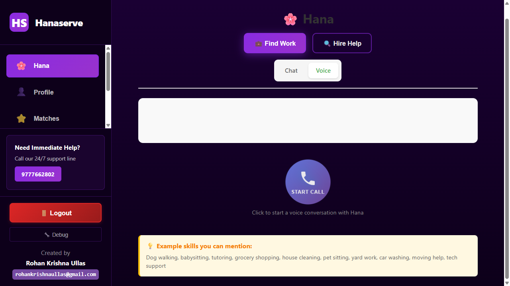
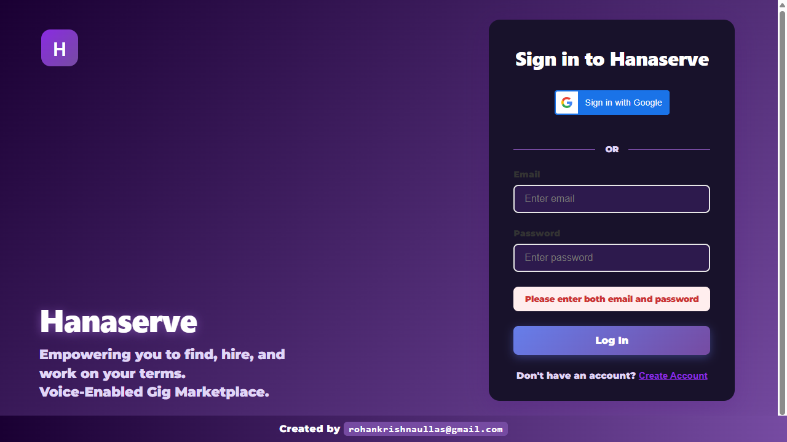

# Gig Jobs App

A voice-first React web application for connecting service providers with people who need help with spare-time gigs like dog walking, babysitting, tutoring, shopping, and companionship.

**Live Demo**: [https://black-tree-0a168a700.1.azurestaticapps.net](https://black-tree-0a168a700.1.azurestaticapps.net)

## 📸 Screenshots

### Dashboard & Navigation
<p align="center">
  
  
</p>

### Provider Flow - Finding Work
<p align="center">
  
  
</p>

### Requester Flow - Getting Help
<p align="center">
  
  
</p>

### AI Chat and Job Matching
<p align="center">
  
  
</p>

## 🎤 Voice-First Design

This app is designed to be **voice-first**, making it accessible for users who may not be fluent in English or prefer speaking over typing. Users interact with the app primarily through voice commands using the Web Speech API.

## ✨ Features

### For Service Providers
- **Voice Setup**: Tell the app your name and skills through voice
- **Smart Suggestions**: App suggests similar skills based on what you mention
- **Job Notifications**: Get notified when someone nearby needs your services
- **Easy Acceptance**: Accept or decline jobs with one click

### For Service Requesters
- **Voice Requests**: Describe what you need through voice
- **Automatic Matching**: App finds nearby providers with matching skills
- **Rate Calculation**: App automatically determines fair hourly rates
- **Quick Connection**: First provider to accept gets the job

## 🚀 Getting Started

### Prerequisites

- **Node.js** (v14 or higher) - [Download here](https://nodejs.org/)
- **npm** (comes with Node.js)
- **Chrome or Edge browser** (for best voice recognition support)

### Installation

1. Clone the repository:
```bash
git clone https://github.com/Kakarot-2000/gig-jobs-app.git
cd gig-jobs-app
```

2. Install dependencies:
```bash
npm install
```

3. Start the development server:
```bash
npm start
```

4. Open your browser:
   - The app will automatically open at [http://localhost:3000](http://localhost:3000)
   - **Allow microphone access** when prompted (required for voice features)
   - **Allow location access** when prompted (required for matching nearby providers)

## 🎨 Design Theme

- **Primary Colors**: White background with Clay Pink (#D4A5A5) accents
- **UI Elements**: Rounded corners, soft shadows, smooth animations
- **Responsive**: Works on desktop and mobile devices

## 🛠️ Technical Stack

- **React 18.2** - UI framework
- **Web Speech API** - Voice recognition (browser-native)
- **Geolocation API** - Location-based matching
- **localStorage** - Data persistence (V0.1)

## 📱 Browser Compatibility

- ✅ **Chrome/Edge**: Full support (recommended)
- ⚠️ **Firefox/Safari**: Limited voice recognition support

## 📋 Usage

### As a Service Provider

1. Click "I Want to Work" on the home screen
2. Click "Start Speaking" and say your name
3. Tell the app your skills (e.g., "I can do dog walking, babysitting, and tutoring")
4. Respond to skill suggestions from the app
5. You're all set! You'll receive notifications when jobs match your skills

### As a Service Requester

1. Click "I Need Help" on the home screen
2. Click "Start Speaking" and say your name
3. Describe what you need (e.g., "I need someone to walk my dog")
4. The app will find nearby providers and notify them
5. The first provider to accept will be connected with you

## 🔧 Project Structure

```
gig-jobs-app/
├── public/
│   └── index.html
├── src/
│   ├── components/
│   │   ├── VoiceRecorder.js      # Voice input component
│   │   ├── ProviderFlow.js       # Service provider setup
│   │   ├── RequesterFlow.js      # Service requester flow
│   │   └── JobNotifications.js   # Job notifications
│   ├── utils/
│   │   ├── storage.js            # localStorage utilities
│   │   └── jobMatching.js        # Matching algorithm
│   ├── App.js                     # Main app component
│   └── index.js                   # Entry point
└── package.json
```

## 📝 Version 0.1 Features

- ✅ Voice-first interface
- ✅ Service provider registration
- ✅ Service requester flow
- ✅ Location-based matching
- ✅ Skill-based matching
- ✅ Automatic rate calculation
- ✅ Job notifications
- ✅ localStorage data persistence

## 🔮 Future Enhancements (V0.2+)

- Backend API integration
- Real-time notifications (WebSockets)
- User authentication
- Enhanced location services
- Payment integration
- In-app messaging
- Profile management
- Rating/review system

## 📄 License

This project is open source and available for use.

## 🤝 Contributing

Contributions are welcome! Please feel free to submit a Pull Request.

---

**Note**: This is V0.1 - a prototype using browser localStorage. For production use, a backend API would be required.
